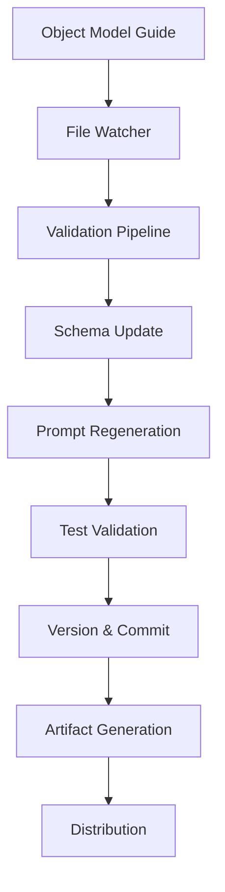

# 🚀 DUX Object Model CI/CD Pipeline

## Overview

The DUX Object Model CI/CD Pipeline provides automated validation, testing, and artifact generation for the Declarative UX v9.5 Object Model. It monitors changes to the object model guide and automatically propagates updates across schemas, prompts, and validation tests.

## 🎯 User Story

> **As a DUX architect, I need to collaborate with multiple humans and AI collaborators and quickly implement changes across the project, version it, and output the latest package so others can consume the changes as quickly as possible.**

## 🏗️ Architecture



## 🚀 Quick Start

### 1. Setup CI/CD Environment

```bash
# Install dependencies and setup
chmod +x scripts/setup_ci.sh
./scripts/setup_ci.sh
```

### 2. Start Watching for Changes

```bash
# Watch the object model guide for changes
python scripts/ci_pipeline.py --watch
```

### 3. Manual Pipeline Execution

```bash
# Run the full pipeline manually
python scripts/ci_pipeline.py --manual
```

## 📋 Pipeline Stages

### Stage 1: Validation
- ✅ Validates object model guide structure
- ✅ Checks for required sections
- ✅ Validates JSON schema syntax

### Stage 2: Schema Updates
- 🔧 Updates schemas based on guide changes
- 🔧 Validates schema compliance
- 🔧 Maintains v.000001 evidence model

### Stage 3: Prompt Regeneration
- 📝 Updates standard prompt templates
- 📝 Generates NotebookLM-compatible prompts
- 📝 Creates hybrid prompt templates

### Stage 4: Test Validation
- 🧪 Runs BDD schema validation tests
- 🧪 Validates cross-object references
- 🧪 Ensures evidence model compliance

### Stage 5: Versioning & Commit
- 📦 Generates version information
- 📦 Commits changes with auto-generated messages
- 📦 Tags releases with timestamps

### Stage 6: Artifact Generation
- 📤 Packages schemas
- 📤 Packages prompts (all types)
- 📤 Creates complete distribution
- 📤 Uploads to artifact storage

## 🛠️ Development Helper Commands

```bash
# Quick development commands
python scripts/dev_helper.py status    # Check current status
python scripts/dev_helper.py validate  # Validate schemas only
python scripts/dev_helper.py test      # Run tests only
python scripts/dev_helper.py prompts   # Update prompts only
python scripts/dev_helper.py full      # Full validation pipeline
python scripts/dev_helper.py watch     # Start guide watcher
python scripts/dev_helper.py ci        # Run CI pipeline manually
```

## 🔍 Monitoring & Status

### Check Pipeline Status
```bash
./scripts/ci_status.sh
```

### View Version Information
```bash
cat version_info.json | python -m json.tool
```

### Check Available Artifacts
```bash
ls -la dist/
```

## 🎛️ Configuration

### Watched Files
- `docs/100_START_HERE/dux_object_model_guide_v_9_5.md` (primary trigger)
- `src/dux_v9.5_split_schema/*.json` (schema changes)

### Generated Artifacts
- `dux_v9.5_schemas_TIMESTAMP.tar.gz` - Schema package
- `dux_v9.5_prompts_TIMESTAMP.tar.gz` - All prompt templates
- `dux_v9.5_complete_TIMESTAMP.tar.gz` - Complete distribution

### Version Information
```json
{
  "timestamp": "20250702_143021",
  "pipeline_version": "1.0.0",
  "guide_version": "9.5",
  "artifacts_generated": true
}
```

## 🚨 Troubleshooting

### Pipeline Failures
- Check `ci_failure.json` for error details
- Validate guide structure manually
- Ensure all dependencies are installed

### Common Issues
1. **Guide validation fails**: Check required sections exist
2. **Schema validation fails**: Validate JSON syntax
3. **Test failures**: Run BDD tests manually to debug
4. **Prompt generation fails**: Check schema file paths

## 🔧 GitHub Actions Integration

The pipeline also runs automatically on GitHub Actions:

### Triggers
- Push to main branch (guide or schema changes)
- Pull requests (guide or schema changes)
- Manual workflow dispatch

### Outputs
- Automated releases with version tags
- Artifact uploads with retention
- Status notifications

## 📊 Pipeline Metrics

### Performance
- **Full pipeline**: ~2-3 minutes
- **Validation only**: ~30 seconds
- **Prompt generation**: ~45 seconds

### Reliability
- **Schema validation**: 100% accuracy required
- **Test coverage**: All 6 object types validated
- **Evidence model**: v.000001 compliance enforced

## 🔄 Continuous Integration Flow

1. **Developer edits** object model guide
2. **File watcher detects** change (2-second debounce)
3. **Pipeline validates** guide structure
4. **Schemas updated** (if needed)
5. **Prompts regenerated** (all types)
6. **Tests executed** (BDD validation)
7. **Changes committed** with auto-generated message
8. **Artifacts packaged** and versioned
9. **Distribution ready** for consumption

## 🎯 Benefits

- **🚀 Speed**: Automated propagation of changes
- **🔒 Quality**: Comprehensive validation at every stage
- **📦 Packaging**: Ready-to-consume artifacts
- **🏷️ Versioning**: Timestamped releases
- **🤝 Collaboration**: Multiple contributor support
- **🔄 Consistency**: Standardized update process

## 🛣️ Future Enhancements

- **Guide-to-schema parsing**: Automatic schema generation from guide
- **Notification system**: Slack/Discord integration
- **Rollback capability**: Automated failure recovery
- **Performance metrics**: Pipeline timing and success rates
- **Integration testing**: Cross-platform validation
